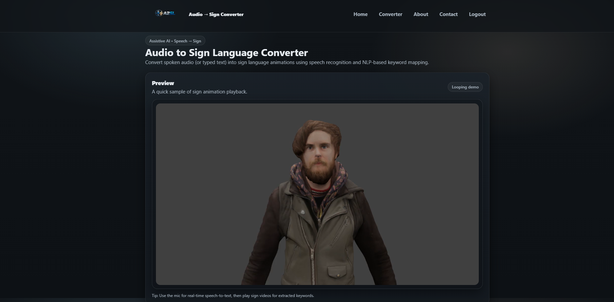
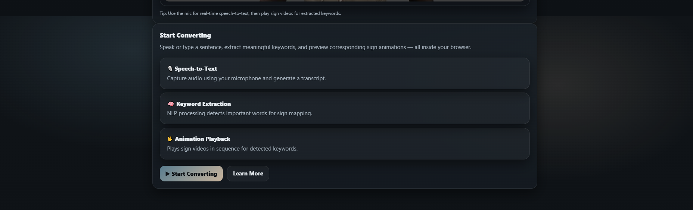
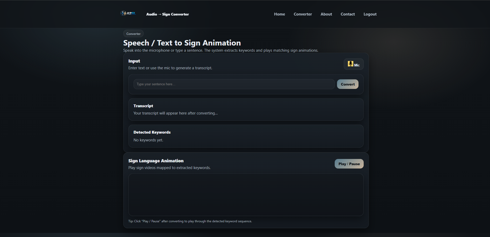
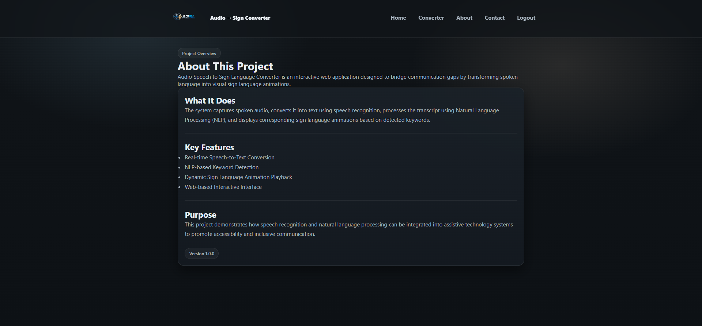
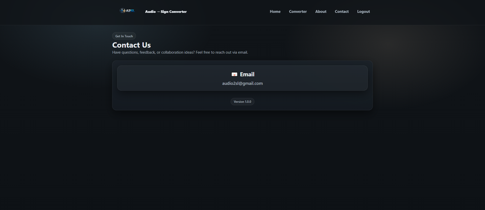
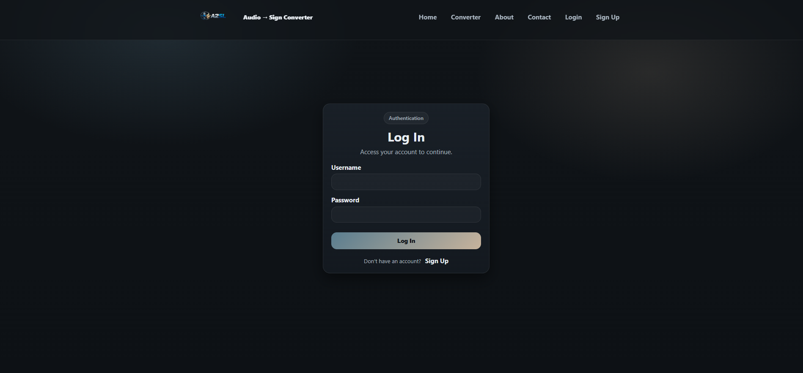
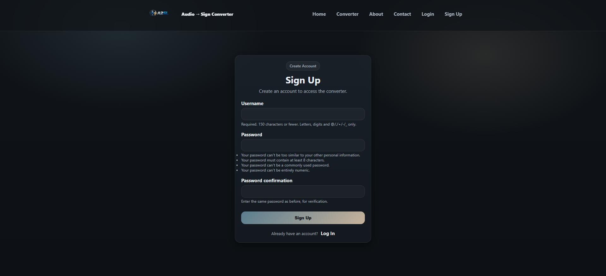

# A2SL — Audio to Sign Language Converter

A2SL (Audio to Sign Language) is a web-based assistive AI application that converts spoken audio or typed text into corresponding sign language animations using Natural Language Processing (NLP) techniques.

This project demonstrates the integration of:
- Speech-to-Text
- NLP-based keyword extraction
- Lemmatization & POS tagging
- Dynamic sign animation rendering
- Authentication system (Login / Signup)

---

## Features

- Speech-to-Text input using browser microphone
- NLP pipeline (tokenization, POS tagging, lemmatization)
- Word-based sign animation playback
- User authentication (Login / Signup)
- Modern dark UI with custom A2SL branding
- Fallback to character-level animation if word animation not available

---

## 🛠 Tech Stack

- **Backend:** Django
- **Frontend:** HTML, CSS, JavaScript
- **NLP:** NLTK (WordNet, POS tagging, Lemmatization)
- **Authentication:** Django Auth System
- **Static Handling:** Django Staticfiles
- **Version Control:** Git & GitHub

---

## Application Screenshots

### Home Page



---

### Converter Page


---

### About Page


---

### Contact Page


---

### Login Page


---

### Sign Up Page


---

## Installation Guide

1. Clone the repository:

```bash
git clone https://github.com/YOUR-USERNAME/A2SL.git
cd A2SL
```
2. Install dependencies:
```
pip install -r requirements.txt
```
3. Run server:
```
python manage.py runserver
```
4. Open browser:
```
http://127.0.0.1:8000/
```
--- 
## NLP Processing Pipeline

- Tokenization
- POS Tagging
- Stopword Removal
- Lemmatization (WordNet)
- Word-to-Animation Mapping
Note: If animation is unavailable for a word, the system falls back to character-level animation.
---
## Future Improvements

- Transformer-based sign translation
- Real-time sign avatar generation
- Cloud deployment (Render / Railway)
- REST API support
- Docker containerization
--- 
## Author 
Jayanth Kumar


